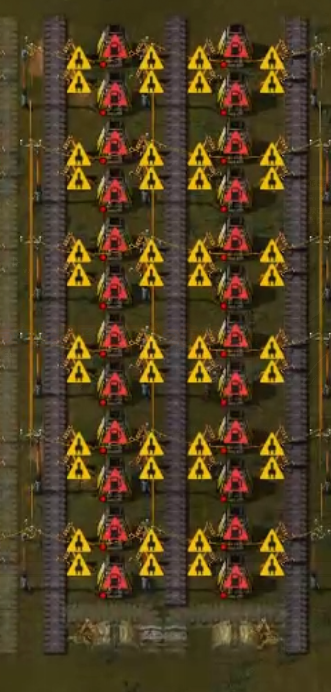

# DesignDoc: Starting Age Factory Design
Note: Pls file an issue if you want English version. I'll translate it. :)

## Goal
本工場は以下の要求を満たすことを目標とする。

### 何をどのぐらい?
- 最初期
  - 黄赤sp (1ips)
- 終盤
  - 黄赤青紫sp (0.5ips)
- てきとーな量@Mall
  - 高速(ベルト|分配器|地下ベルト)
  - 中型/大型電柱
  - 鉄道セット(信号,線路,倉庫,スタックインサータ)
### いつまで?
- 鉄道IO加工工場の完成
  - 完成後、本工場の部分的にdeprecateしていく
- 原子炉の整備
- 電気炉精錬場(+60ips)の完成

### Non-Goal
- 15ips以上の鉱石精錬
- 発展回路基板(赤基板)以降

## Overview
### Smelting Factory Design

- 15ips
  - IronPlate (2 lanes)
- 7.5ips
  - CopperP (1 lane)
  - TinP (1 lane)
  - LeadP (1 lane)
- 3.75
  - StoneBrick (1 lane)
    - 線路に必要

**Total:** 6 lane

### Main Bus Design
2 belts, 2 space

#### Why `2 belts, 2 space`?
- 2 belts:
  - 低速地下ベルトが地下潜れるのが2マスまで
- 2 space:
  - 地上にでたベルトが地下に戻るのに2マス
- +:
  - belt splitterをおいても余計な地下ベルトが必要ない

#### 流すもの
- 精錬場の出力
  - IronPlate
  - CopperP
  - TinP
  - StoneBrick
- 精錬場直結工場の出力
  - IronGear
  - Steel
  - SteelGear
- 回路
  - 黄回路基板
  - 黄回路
- ほか
  - bronze
    - 高速ベルトを作るのに必要のため
  - 石
    - 低速地下ベルトを作るのに必要
    - おのれbob's

#### 流さないもの
- 木材
  - 木材を必要とするのは黄回路基板、低速ベルトのみ個別につなげれば良い
  - Note: このデザイン決定により、木材工場のpriorityが上がる
    - Because: main bus直結駅から木材搬出ができないため、別途Railway Interface型の工場が必要となる。
- Solder
  - 要求量そんなに多くなさそうだし工場長ががんばればいいんじゃね(無根拠)

#### Why this order?

  Sorted by ingredient similarity (feat. Jaccard coefficient).

##### What is ingredient similarity?
Jaccard coefficient in their ingredients.
- Given item $a$ and $b$.
- Let $I_{a}$ be the set of items whose ingredient is $a$.
- Define ingredient similarity ${is}_{A,B}$ as $\frac{|I_a\cap I_b|}{|I_a\cup I_b|}$
- ex.
  - IronPlate is often used with IronGear.
    - Thus, IronP is next to IronGear
  - BronzePlate is mixed from CopperP and TinP.
    - Thus, CopperP is next to TinP.

##### Why their are put close to?
- Pros: Association: Easiness to remind them.
- Cons: Belt complexity.

反省点: Belt complexityが増えるから、近くするべきでない。この設計判断は間違い。

### Mall Design
Underground bus paradigm

#### Why?
- bob'sのせい！！！！！
  - i.e. 原料の種類が多いため
  - Underground busは理論上1面6種類までの入力を可能とする

### Process to deprecate
- 鉄道IO加工工場への搬出用に、Main busの終点に駅を作る
  - 鉄板, 銅板とかそういうののために
- 鉄道IO加工工場を実装する
- 電気炉集団ができるまでがんばる
- もし初期鉱脈がきれたら鉄道駅を作って外部から鉱石を溶鉱炉に搬入して延命
- 電気炉集団ができたら
  - 溶鉱炉を解体メインバスに流す
  - main bus終点駅をdeprecate, 溶鉱炉駅を使うようにする
- main bus終点駅の代替駅/代替mallができたら、main bus解体
- おわり(NHK)

## Alternative Consideration
### Main Bus: Why Main Bus?
**Terminology:**
- sub-factory
  - main busから支線を引いて実際の加工を行う工場
- `bus流入量`/`bus流出量`
  - main busに(流入/流出)するアイテムの量、単位ips
- `bus流量`
  - main busが運べるアイテムの量、単位ips
- 構成率 (item composition rate)
  - IronGear 1つはIronPlate 2枚からできる。
  - このとき、IronGearを基準としたとき、IronPlate (1枚分)の構成比は0.5。

#### When Main Bus Fails?
- 各sub-factory間で流量調節が必要なとき
  - ex. 上流が大量に使ってるけど、下流に流したい！
- 流量に関する要求が変化したとき
  - ex. IronPが15ipsのつもりで設計したけど30ips必要だ！
  - よくある対応策: たくさん予備レーンを**前もって**用意する
  - このとき、Main bus自体が問題となるのは、`bus流量` < `bus流入量`のとき
    - ex. 精錬場は拡張できたけれど、Main busが拡張できない
      - i.e. 下の`Main busがボトルネックになった`とおなじ
- main busがボトルネックになりうるとき
  - i.e. `bus流量` < `bus流出量`かつ`bus流量` < `bus流入量`のとき
  - ex. Main busがボトルネックになって精錬場が遊んでる！
- Busが超長いor超太いとき
  - スペース食いまくる
  - high latency(アイテムが末端へ到達する時間が長い)
    - 流入したアイテムが末端に到達するまでにかかる時間はbelt長に比例
      - `belt長 (tile) * 8　(items per tile) / belt throughput (ips)` (sec)
    - ex. 15マスで15ipsのbeltなら8秒かかる
- 構成率の低いもの材料を運ぶとき
  - IronPを2ラインで運ぶよりIronGearを1ラインで運んだほうがいいよね
  - 埋立地のための石とかをMain busで運ぶと辛いことになる、専用の搬入口を引くほうが良い

#### When Main Bus Wins?
- Sub-factoryが多くないとき
- main busがボトルネックになりえないとき
  - Or
    - `bus流入量` <= `bus流量`のとき
    - `bus流出量` <= `bus流量`のとき
- Busが短い、細いとき
- 構成率の高い中間素材をMain busに流すとき
  - IronGearとか回路とか
- とりあえず動けばいいとき
- 頭使うの疲れたとき
  - :beer::sake::cocktail:

#### Why Main Bus in Starting-Age Factory?
- Q. 各sub-factory間で流量調節が必要?
  - A. 流量調節するほどの大規模工場じゃないよ
- Q. 流量に関する要求が変化する?
  - A. 要求流量がかわっても精錬場(~15ips)がそもそも対応できないよ
- Q. Busが超長い?太い?
  - A. 初期工場だからそもそも長くできないよ
- Q. main busがボトルネックになりうる?
  - A. なりえないよ、精錬場の出力が15ipsだから、黄ベルトを使えば常に `bus流入量` < `bus流量`だよ
- Q. 構成率の低いもの材料を運ぶとき
  - A. Iron gearをmain busと独立して生産して流すから、まぁ問題ないやろ。知らんけど。

以上より、Main busを使わない理由がないので初期工場で使います。