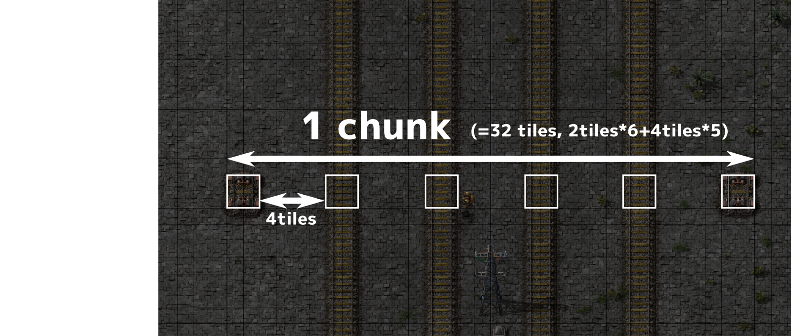
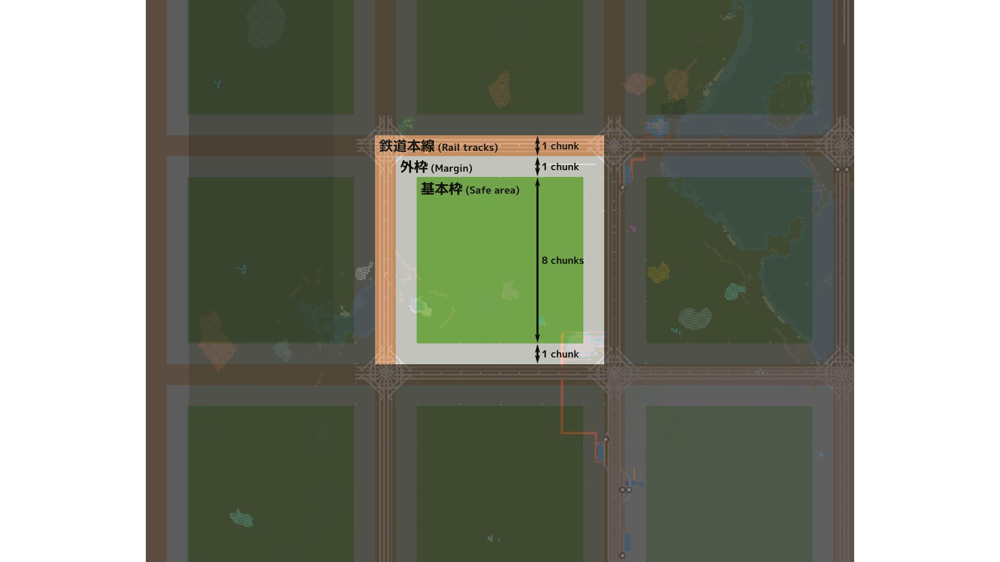

# Grid Layout

## Overview
- 複々線(4 space)
- Grid base unit: 11 chunks
  - Rail tracks: 1 chunk
  - 基本枠: 8 chunk
  - Margin: 1 chunk
 
 




## 考えたこと
### 複々線
- fault tolerance性
  - 一本がだめになっても大丈夫、(e.g. 燃料切れ, メンテナンスで停止中)
    - 反論: gridにしているから1 pathに対する冗長性はいらないのでは？
- 輸送量
- 基本枠を大きく取れる
  - 大きい工場を作れる - やったー！
  - pros: Design flexibility
  - cons: Decision decision derived from design flexibility
- 追い越しができる
- 純粋に見た目がいい

### Others
#### 交差点通過時間を減らせ
前セーブデータの経験(+SimCity,Citiesのプレイ経験)より、交差点が渋滞の原因である。交差点で待つ時間もしくは減速での交差点侵入が渋滞を引き起こす。ならば、交差点を減らすべきであり、低速で交差点に侵入しないような設計にすべきである。

#### 鉄道本線間の幅を広く取ろう
基本枠を大きくすれば、面積あたりの交差点の数を減らすことができる。オーダーの計算はめんどくさいので気になったら各自やること。二乗とか平方根とかがでてきたらよさそう。

ちなみに、基本枠を大きくすれば、低速で交差点侵入する確率が減る、はず。

#### 加速軌道をつくろう (実証実験中)
高速道路では加速車線で加速することにより、後続車に減速させないような設計がなされている。これは、前述の通り、低速での交差点侵入を防ぎや後続車の減速を緩和し、ひいては渋滞の緩和につながるはずである。たぶん。

本設計では、鉄道本線を基本複々線とし追い越し軌道を確保した。加えて、部分的に三複線を想定し用地を確保することにより、加速軌道を必要に応じ追加できるようにした。


#### 可用面積率
Railway grid baseの短所は、可用面積率が低いことである。

可用面積率とは、$(工場建設に使える面積)/(全体の面積、線路の面積も含む)$である。

本定式化の場合、基本枠の面積64chunkが`工場建設に使える面積`であり、全体の面積は121chunk(=11x11)となる。なので実は、可用面積率は半分ぐらい(53%=64/121)しかないっていう。。。人間の視覚って当てにならないね。

## 🍶ぽえむ: でっかいおおまか vs. ちっさいこまかい
基本枠のサイズ$k$が大きい場合、軌道の本数を多くすべきである。理由として、"本線が持つべき搬送能力$t$"は"基本枠の面積$k^2$"に比例すると考えられるためである。たとえば、基本枠の幅を倍とすると、基本枠内に建てられる工場は4倍となり、搬送すべき物資も4倍になると概算できる。よって、鉄道運送能力を4倍にするべきであろう。よって、基本枠サイズ$k$に対し、鉄道本線が持つべき運搬能力$t$は$k^2$に比例するといえる。(雑な議論)


このように定式化すると、何かしらの最適解を求めたくなる。このときの最適性とはなんぞや。ここでいう"最適"は、面積効率でもエネルギー効率でもなく、開発効率でろう。(面積効率,つまり工場面積あたりの生産数を最大化をするならば、逆数の法則と圧縮の原則より格子状に運送ネットワークを敷設することとが非効率なのはあきらかである、最適解は放射線状と近い形となるだろう。)

そもそも、グリッドベースは汎用物流ネットワークレイアウトを規格化する設計思想である。
では、なぜ"専用"線ではなく"汎用"線とするかか、なぜ"ばらばら"でなく"規格化"したか、の理由を考えると。取り回しの良さ、つまり運用上の効率や工場建築の効率を上げるために、グリッドベースを使用していると言える。

では、どのような$k$が"開発効率"において"最適"なのだろうか？
見方を変えて縦横$N$tileのマップがあったとして、ここにどの程度の間隔で線路を引くべきか。という問題として定式化すると、太い線路を大まかな間隔で引くべきか、細い線路を細かな間隔で引くべきかは、複数の事象に依存した問題であると察することができると思う。レシピ構成、レシピの陳腐化の頻度、一般的な加工工場建設に必要な面積などである。例えば、エンジン工場を考えると、エンジンのレシピは加工時間が長いため、必要な物資輸送能力に対し加工工場の面積が大きくなりがちである。このようなレシピが多い場合、基本枠サイズは大きくしてもよい。一方で、Angelsのような少量多品種の構成では、多種な加工工場が必要なため、鉄道本線とのアクセスしやすいほうが良い、ならば枠を小さくしてもよいといえる。このように、"開発効率"というものは、なんかいろんな因子があってよーわからんのじゃ。

なので、小生は好みの問題ってことのして逃げたいでござる。ちなみに、小生はおっきいほうが好き。だって工場主の作風が出るし。でも、小さくしてがんばって詰め込むのも楽しいでござる。今回は、大は小を兼ねるから大きく取ってあとで区切って使うおきもち。


> 先程の文だと、グリッドベースでは"開発効率"しか意識しないみたいな悪い書き方だったが、
> `渋滞しない制約下で ある$t$において $k$を最小化`
> みたいに定式化すると一応なんか最適解が出そうな問題に定式化できる。"渋滞しない"制約がill-definedな感じがして解きたくないけど。

## 🍶ぽえむ: "最適"と付き合うのは大変
Factorioでよく"効率的な"や"最適な"などの用語を使いたくなるが、これらの用語を明確に定義せずに用いるのは危険である。
多くの場合、`工場面積あたりの最終アイテム生産量 (item/area)の最大化問題`での"最適"を指していると思われるが、`単位時間あたりの生産量(e.g. spm)の最大化問題`や、生産性モジュールで`一定材料での最終アイテム生産量 (outputs/ingredients)の最大化問題`というのも考えられるし、`クリアまでのプレイ時間最小化問題(a.k.a RTA)`も考えられる。

このように"最適"という言葉はめんどくさいので、意識して動画内で使わないようにしている。本シリーズにおける"最適"をあえて定義すれば、`工場長のストレスを最小化しながら、工場長が感じるロマン度合いを最大化問題`において最適を目指すだろうか、多目的関数最適化は係数の塩梅がめんどくさいが、そこらへんはシェフの気まぐれである。感性評価にすれば、最適性という悪魔から逃れることができるし、「なんかいろいろかっこいい！」がロマンかなって。とりま、結局楽しんだもの勝ちだと思うので、議論することはどんどんやればいいとおもう、最適を考えるのおもしろいしたのしい。


もし、最適について議論したいなら、何を最適化(最大化/最小化)しようとしてるのか、何が制約条件であるか、の共通理解がないと話が噛み合わないので使うときは意識しよう(自戒)。
RTAでスタートタイミングとゴール条件決めるのと同じ。
もし私が動画中で変な定式化してたらおしえてほしい、なんでもしますから。

蛇足だが、制約条件なし(ups, 土地)でspm最大化を行った場合、最適戦略は`単位面積あたりの生産効率(item/area)`は関係なく同じ工場をコピペしまくることである。みちみちに建てるメリットなんてなかったんや！

ちなみに、小生は最適解を議論するとき、手で最適化するより先に定式化してアルゴリズムを考えてしまうめんどくさいかなしい人間である。`spacechem`とか`Opus Magnum`とか`baba is you`とか`Kerbal Space Program`も好きだけど、うんうん唸るのにすぐ飽きてソルバーを考え始めてしまってなんか違うゲームになっちゃう。かなしい。
Factorioもそうなりつつある、にゃーん。

> 呑んでるときの私、それっぽいこと言ってるけど、だいぶ雑な議論しかしてなくて、だめ。


## Appendix: 交差点
```
0eNq9ndtunEeuhV9lQ9dWUEXWMa+yMdhwbCEjwJEN2RlMEPjdt2R3t2SZpV5fNWZuEkSWV/iTrAPJVeTfV799+PPm0/3t3ZerX/++un338e7z1a//+/fV59vf795+ePzZl78+3Vz9enX75eaPqzdXd2//ePyv+7e3H66+vrm6vXt/8++rX/PXf7y5urn7cvvl9ub73//2H3/9392ff/x2c//wC6e/+fnLw9/9/Z9frr9BvLn69PHzw9/6ePf4v3pAus7tzdVfD/8u7evXNz/hmI6TXsPxH77k+vC1P6OMX+oR5pf68L3vb+9v3n3/hRLAFlm88pp0VZTOmHTtR9h3/3x7e7cETz9gB2hd/VZ77VMHkamdk2mqMo3XZHp0HQ0mv2rGnLm3lhDIsF/FOE5tFsMUquYYpnL1WAj05Njv/rz/1837FczBe3z+uFZqhNmxymPZhiabx6JFyzhPasVQMkvUijHMhpOnEIg7eYyDnTyGwU4ew3An9xECNaqeBQ7dtxcwA6pnATPFpfu4l36D8fNr12XPvj4KV35E7REqd3SP7x5GzrynK4hLh7w7/vj2I6pHqAXJXE8y15cyhwar2LdjzTbq2zFM15yyn1wyAkE3G18rLPRF+QhosY0jK5REQV+smhyB5q0Lni8ueMU008x4twjv7E53stBpSuHbg523dNk4P8r59VzaDmwEhO9JC5xBl24MQyOAl8qKFkalN6WXho0WRs1c0ggGRMRHzaXzbledw9p5t6tbiyQCqptnaFbO0AoDChMCisoXSvzl6Fx5ShG4SV8+t3IE38CjjENC0Y8J0U/LdKMI1djkdbParSMjN+c7RQRTsHDp/I7TwFFycEEb57eK1jDsS2mjraJ1vlWEEVgbe1uFTSmnNvGyDqXsibp1DINPlRhGXx2LQyVaHd0p6kv/i9y6F5xbtnberXvlsOO8W3eUhL3Op8DAuhJJdb5qLAzM+6B+vcB5Wh+/3f5+ffPhQfr723fXnz5+uImEOn7sw6e++3h39/1bPz/+cX78x/3N++flhdv3j/d3e6w+/H5/c3MX/tnXMO9M11v8eYOutwUMSgnkvHaKyJWH03z2S0+OXG0UjNrOr+YBlt1RpULyZjQOK6RFRqfJFknYwRdxXFyZWDzho2faywWZlAuaGW884bdP27sn/yxldOxP37onfwOP4ArdjeJvrjCDY0JaaLatRJZJiazZt9JDtqr/DaoAIYU1aU7BFlVFvawIzJNTxrDCR+ekJxbsuAkJ+aycXM34H3J49iKH10LUwqUV0mQ5bcRML3AtxOX5N027HedtNHk3jiRJv/Ni3FBevYT/HDdEypce8bGA+vJqBNbx6SnBlg3YEEhfT8Q9s7yckBPRUqmGOjhqiCMvHWJpSxeeoDEqDpOEtHzWGQMj3kLDg8/8QlljDRSOGuJUmhrUxGs4NSPBipXU3OOzPjwzdOpBRt40MaziToCMYEfVCgWa/IyO8Po9yg7J9TwVaY1LK9R9svtu2uunskV4//PC7z2SlivHlfSxdf8LkfpmeluqhGVGY3gW7It2w+nzhRpK2gz3pbJYZjSGBLVQjF4JFkpAq4zaquCqlAkls6wzHMbrH9+weELRLJe+mZoVlarfBpFSRV6d5dPhEDJ0E5ZO0anOfbi2w7LPQiUyAzLEEdeEUmQmbAgkb+HZBUlexo54cto8lRRtrhunV4odDLMiVkBja4P+9sEhHiVZL+RqaSvBuZSr4UhqIReu8JpQ4c0NnUBz7XfhegG8CIuXYbgd6cQIQ7poFFaTVl8ydojRc1OUOziuUPDOgCGRibw9qYnkQ3CZq6DdroZV+ei6XTjlu3EdKLrtjjfil7hh3N7LDm6IVGn6VBOw0fSpBouPIw12bMCGQJOmTyX5dDIEcaJBmXoaqnHUEMdh+lSTrsD0qYZKQyQNtXHUEEdN8nm8Y4Y72xDfzZ224fi6pDMgVhf38Gif+IVoFrgvWec+GJLWMKwkLag1LQ720C8nqOUePVNg1eRZOa5Ah8mTc4s0eTvHleQdu9Fhk1IaU33TdyjwZ+GRjqW0l+bM0qM5Syi/d92YSiyJz5aunajE91KeqkqKuAPHItcQs+5F6Qu6jyXGpk3UbOwhoKaCsZWjVSWee/G3hp4xgykLDCbLmMGUBQaT6RQLQ9I6hpWklU+9UvTD1J4RLs7sPMetJyuo+pHnx5BBoC8Z6LpwwhVoRpbho6l+WhiuJEQtT57QLnETBFjHsrWk4a4O2jUYsZxxuqBkOZ2NsbpbhQbT6RgnWKHYb4bON0s/GC8E5DnEhV+hMpbVtVvF5tfLWMhME8MqZnL1WWKO98RQBaA/hB9tlRRc47gCBcFAowhD8ha+F8adZQD5wtCXwzdYT9ekLJ0GkJKR2xo/3MMZJyOXH+BDwEnLvFkoQhvjZOS+VkPoaCVjqYXitAEyhr3qvnpjCUdaLRhW+uzKszlJuCqCThOni62EC1L1RnBBrj4RXP2K6APg1gQv+FMI9ABBww9GE/gOBvgZTnwM8DN84WPhQQH4GU58t9aLrwox7kZYJuF2njmVcAe+KkhuNnklWxG3JX6ziZvCtbyDdN5hm12MG3/55XfFGJc/29Jw+SvilaXaDpIgYVd5BvG2HZt/4Kq4QGQxwOBo4SoNLxydZTpOjPCfqEIxeqaVcmVn0XkcCegXsDgMbAY6iSMBq7EMBzQaCszyEjxWR4cFf8khBmURSJYTK2jHppjKlW7w3H28I468AXR+Q9R5HWif1Wkeq4MrXLI6zwOdW6NuSBsC4byhsvj1dhfoFqD3u0CXFp37gW6BOvcD3YV17ocTR9W5Hygi0LkfDvxLZ36gsEgnfqAoTud9oGBWp32gPIHeGgOlNfTmGCQL43qvDJI0ckjzKKfM7FDq467TPA7Ul6rI7DhpIlCHPbGOzk5VodadjaiCJe6NysyZ9ZKmd7IcIdDcrA13qXF4TptlEU27ZBrGeE0N2TbLK6IaOKdeYEs6b6EhUDs9487pTel03y5EjTXQL9RAuLpwOw1JrfT1l6JVS5eBhkq1fNnnhzrFjTWkz/e9qqW2uwBCR3ttc2EMDroHAjoH2ASs82AvxBE599bDIzu2OjqznohXmj4dHVkGraUzOhxYi43/cLgOXGyv5sCGL4d/rGQtVFb2TNlPpCRtqAikeRiF7/haF08b8YEvRgsg3O5T4Lt6wdN0BLqr6+SNY01BGdFTbI/G35T0tOuEjqPM0mSdQrP/ktVgC4ClJmKZG5VZ8okOCxaSS4y9JwKiS0wosuIReteNojtERamPwvxBJ3aAxVzpC03Fxyp9oCkZrO5dbRfPWlznceT22oFQ+x4dua7kGvSiuZCLXQp9eTCHfsNabjhFz5gnJ3TKc8DcKAXAOmbJSbAFk+Qk2Io5chJswxlUCbZjdpgEOzA5TIKdmBumwPaEqWESbMapWAmW86NKPCHQN4AE+QrmWUmwFdOsJFjOjVpos28ACfINyLESuo96Z0n4U8rBpfvkSHvoRTq7Bu9lraDahaFceF8dfmHYGVpP522c2m4rVqt7VDbRJ3CwJVntwmArNtq4MC6MjUaDLMVmbIpJXposlFgncxTdYjqVo+i61YkcYO1OGmRJBkOLrEODNca4E2ZSuE7kyO2101FnbmRwFZq43bWAWhJuGCqhZhp3xsNhk3EcQTqnRR0JtVD2moRaKXlNQm2UZCahdsoGk1AHLepIqJNywRRUvd8GCIeLTsQAsXvRu22AREPRyRggK1Jy2aSBST2dS4bXQYPwDY1UPFZr8396pGLJfbPgJn4351FZLOcuj0rqFV9sl0elqcE4jypWg+3yqEQ5ffcVvKblwoJ7oa1NsUqpX8LL6mIb3bLPX1kL6+hxvVZvD9H5/NfzgUExOu5BaDhRwISVIhvN84XfH9rsGfcDTMMlO3d+vhYff9Lnix+U8vOv+Hq73waMzwi964jpDoCnZwquqjcfMWD/dtHXx57atwq7UiuTonNThm4uPE9TELQkFMALDX0Km/nyVNXVjke9zchpbGe4oNjMl6caryhlwa3xYynrXsVXlBLdiK3+ty7EbHaMU9sMSssTcaeG+xQXpV+E1xulpr2wSETPe8GHiI4Lh+G7zFJ9L/QQpSw0NFhIWfeu7qKUDVZ2hHeOpdJJ7ELKuVTaT0FI4xdGfnm6tyelWFRAj5IWKTe8tjTaTEGxWIO9FBTdNtpJQfGCBvsoSBqtrJYjKbRtXQSTUiApOtlFXwkNNk+QjDWZnIqxWKeS/INmQ7y9i6W2u3Z6r4yPgO5bvftEGcvWnXWpT9o1YfHJbeuOKn7y3lVQBEcc5wIdalLCowmoI1G+o4Sa2QNsgfBTAL2lmC6pUwalhFoogVJCrZQ/KaE2Sp+UUDt7dy55AGZkSpJiQqaCOjEfU0LFdEwJFQdVcXJhOscRpMNcTAkVUzElVMzEXGiycxxBurFFatQKFZM+ehOentSULgv8agiaLwtRPQSl5EvhkUyFk2WcGKwm+t5NMli9KJiM7dUuCyZje0HapWSusUNllAoAVSe2FNlYOV0U94V61Ukt+oLN8FWbYqvsOyxGU2L0ymgtHfmB3mgkt/UBU3PDMGfPl6o3FtEPrZrpYHYJdMJINdYi6CQi30yqZdT9QWDAVqODByU56fwlCbRAXqQEWiEtUgJtkBUpgXbUNUKyPeVZSnJSmqUC6pRlKYFSkqUESjmWEiilWEqgZa+1h8TWr44TEkIrpbrbL0SUGTeXk2TGnMiQGV99kxIpDR2roIVIHq9IyRgZT3XJoklpjFHYhXVQcDM54dFOLWWrhCg9EqyFtpRrCijtKCc8M6qlXyZpuKLKuEzS2GBzqxtLka7mkFeRkDdU2F9OcYYKR7grvlD9IszQarVc9O2hezFqRWGOAAe6S3rtiFfXFfPT92zxYVBpLBXD6IQJ07e7lrdKidJ74NoMTS9UjimdN+FACWWrD4uohEpJak2pdlZGonhqiyyi45YhQmunSjqGfEcdiobZmeUZaQJOfzm1bhTR8XwlRc+8e4iiZ95KJGyqVBmp4tqgvfBEpYWUbe8KL0rZYTVEmPFSO2UBCi3DKmBVmOygOqkiyV8/KPdP8fkBuX+KRgdsFycptDBM6dv3msUterLVQTPq8bocfYvvpS3LMbb4XstPpjc/xc8nzanHepwZw5x37YlealpBxsGjXCRt0kkukhrqVudkUQ1ti0MngnfKoRsK6qAcOgl1Ur6bgNoAo6IkHTVTvpuEamykrjCasfEpLpKkhTLThA7lLdUL44lY1kZlVeZWNzC0xYG7DkrOk1AnJecpqDnRyoKEmin9TXGtvBFChTh+YSgWfzOm/EkuCoa0mO6iYEiL6S6aMQNwYaDBcQTpxMGY19/JvTkL1rG9ObRdSZ83gwPHVuDhYjL5nALaEOdH5CNkCFJ2CGniR4uDxfqrAtKgKXZy6xjmvI8bJR7lpDgibfemiOq025swfKjpzAmwrbnhkDGE8csiz1i2AisQEmiFLCkJlPZ5k1zTO6pnCMOOm06LAPcsvW+F696uUyPAPbPky0L6GNRgjUgCdUjokkALJHRJoBUSuiTQBgldEmiHhC4JFAdEynjiVvAjqCy8Am410fAgnqPdaqaXbOmzSTsJ8tm+13luKgy2VuWOa4e7l58nXbXdVhNToXS1qrb1raHEse36Vv5+xsnsBtgQI/SE8ExlTSZO6fyp1N6bTpk4iiy8sm+NZs4XS1bvK2FAoTpDwsg3F5oQysLDldbYojpNXcxZ2gjAPJWj1EVxKzxQL1vsAWOPzJqlzpMNTFLJwGg9qdvrQVol/9Bxs1DJVF3MPBx7bwo1kqbzIA7BdC6KAuhc2Cy8Nmu9bhU0vzlYiNfo3hd7vs5/MKJDVr6ty+UU+9KkMisWIv0lYlWETjrwQ/gssCwb6DFxhBXIpm242gzhsE67sP2BHhOZqKBiWEkFkG90eh1blMJuY7SJ6w7RxxZtXEWHbz6W6KGbsPkq6Tl4CLc1vlLUBONXtLOyojBsQln1A62EyyTc4vW2FEdUgUDf1KkqlsPtJ9wndCqFke8fFFX6/gkzMcoZ1BNPbghct54wZzYLdLcOGlRkIq1jWEnaQt9rvZQ2NlndgA2BaO9MTTxKm9VQ6UsqDXVy1AiHsCZ06XTWBPCeDN9LaaCOQUMYyJDVZKus8YYGCl9HaaAdg4YwehLQws2sh6iTogoszI6bT0iyGs7+SbIaJvQILKZujluDCTyhro80+U5vsawoFhw9RAWNwmoq6JvhWlcylx1MNTmewyERoBuLncZSzCh26niiyUJKz3sRniglPZYWQup5vxQ6Uuj2OqlivCpc3QrlupL56jqd4skZz/u4Sqc4VOlMGIzUHTdDkmw0KdNJ+X7QbGIhbLjhFVwJNqFk2wscwnWkH5rUvLfz/hOaMnCYpCmjbkgbArWttJyqVNp3YiXl2NqeVSnnTgLOFk22u06psNe+mY3pgN5e9/J4c/XJzs4QEwrJvcKDyYQ6cq8Vg4YwaNmcLl+qdXCbPkmflD+hKRTXeE2o8faGGyGZUI7tYD7HIRlmQhOv3gzf8SVYp31wJdVefCTFwtYN2BCIZu40y/cLdRl/NJ57I6HSzJ2E2hNHDXHoO3dNOjrkRgKFqTsNtGDQEAYOttFka7C5r8Bq6J1OtJEkHZeBhodRn5fdQ0JJdYLEeM3eOiGC7Lo6H4IcPIMyjCQ/GpRhJNmc0yFMYFl0MHTjCCuwLPro+JQssTuNrbyaSZyEPtTngwfUHsrImA3XRzqUSX1C+6SDhxeaZJyGp+BS6ujZn1Ec9EHGVv/TEzf7LFtBry8iwCk+NvSjv5xfKhOOAF6Zt2/F0VJztT7h1N+VjBOSSkygagyd/pBLuDF6iMpDKIGmMNJueq8qm8XgLAgTWBCDsyAsrGuORHvJrnDoolnAwGrtCoZWa20ofj33ki9VWdJDpztkC9079D/QJGKhinDVZLkT8/eDxcNX3gM0iThI50lRZUFNCDyfP09H5mmGEX8zbbS8wulwxS1gxk5G9vFBSgw3YbThQh1qGA2F4m9VB2jEbhG6ms5fePKK86vWcFHIhaLQMHxquCk6qBvShkB0aaxw+tbN2pNysx42dm6wvijbDL3vg732zQ6XiAup+8HoCafNYVGuGTofYYROHa4VdwwawhSYp3Uh5z28bqy4EKihwNirIhxNTbuQ8B5OSaWrL54ksnNl5RZYIV1IVuAkMxeSVKPAUWYu5KhGcbwphDD83CgxUGVe3GOUtpWCcikFNUrfSh65lDwaeHjFSpNsdQh5j0H5AwvJ9vgDLuU9xh5/wBfvgAblD6w+ma+POG6tNBpf4cBofAUDo/EVzEDhWFHu3aT8f1B5HBO0vVyxD6UX2mg0V7ySEjI5VzBOWrOVOGiHUyOWCguPwQZ5MqsPbXiqU3wtbJRJtsIZcPrNAgYWGhcwoCR/VE98M+jUv1c4dODQAgbu5ysY/IC6xAdDx9f/FdDeladoV56OnXwh5R5dUpVyagNl0nPYCGjAi87ia0fW5Gln5YFh8Uoeh2WXR5x/vLm6/XLzx2OV8MOfN5/ub+++PPz+h7e/3Xx4+Fn5d/kfS5aSp/nw43/d3H/+vnV7yrNZ9v5w4v8/78VBZQ==
```