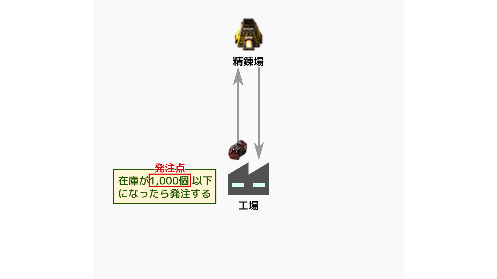

From: 2020-01-13_06-57-01 112010 frame
To: 2020-01-13_06-57-01 223954 frame

## Contents
- 原型室流動
- 馳走スタイル
  - 複数アイテム単一搬入駅
- LTN
- 発注点逐次雑更新法

# 馳走スタイル
一つの列車が複数の搬出駅を経由して、複数のアイテムは混載して搬入するやりかた。


## 長所
- 搬入駅が少なくて済む
  - 敷地面積を小さくできる
- 列車の数を減らせる

## 短所
- 一つのアイテムだけがたりなくても、すべての搬出駅を経由する。
- 大量輸送できない
- 発車タイミングを調節しないといけない
  - 手間!
  - 回路orダイヤ設定にて

# 馳走スタイル搬入駅


```
0eNq1WNGOojAU/Zc+bmBCC4iS+Yx920xIhas2Cy1py2TNhH/fFhQZLTNWMy9qlXs4557bQ+MH2tYdtJJxjfIPxErBFcr/fCDF9pzW9jt9bAHliGloUIA4bexKUlajPkCMV/AP5bh/CxBwzTSDsX5YHAveNVuQ5oKpUmlTuz/ocIAIUCuUqRLc3soghUmAjuZt3ffBDQqZUCwID5UWrQOCnCECZPRoKepiCwf6zoQcBNnawta2UBU3Qt+Z1B2tL1rHK8LfqB8BOZT2bsrWYPuylwB8rppVKI/NtUyWHdPDkvRvtlxpOjJFyKEvnu5ZQckqkGEpmi3jVBvmNzqjUWb2khrgismRFspXbtknyML8VrFJwI5Jpe9vAuVHfWB8j8ZWGDl2cCK7aFoqB6I5ejV1otNt54E8NnGAbY+GZMd1sZOiKRg3OCjf0VqBlwPJrQMBIouXk5khdp1ZxxwmJRNzKpk+NKBZ+aVPxM+nC+pzVgEtD7afCixMcXErxJExTLQgz7P46wG/RngvQ9JvHLjaMnjBgHSictb0Zfvjl9TPgB2rNci7YhBqgyUFHyegFdxQVeMQd7bVySwhg2/RtlQZoPsxyR2YStRm08/K8VQe31F+8iPcCiorJ0oymProplzyeOX7vFi5ULIJpYGKdc2pt6azrajBkajnUVkNo/J41n9OEhwtqFz7qkxcKBtfFOJCwdGjzcJ+zcquuxMvdAf7HhoiJwqZoQDUYXkApR0Y+KQn8pOD42s96yU9sSeT0JfK3YOHLw8xCZU5R9HybzjmXsi4Amk+uA5Wn1r0OUnnqXnOvO9y8s1FLX2KWvij3Hxjyb3TMs85IJ5jsL4aA7K4w9aeTDy3Or7Z62SJyeYp14mv6V8+al3Wk+gpgvjnCfqmpfNZQnzTMvGbiMVRJL7hGHve+CYbl8735LlsTHydPp/QnKY+F4axL5er456Tkm8GOk9m5NGjWWok2T8bhmNqPvv3IkDvRtZQkGUxjtJNtMmyvv8Ptjetyg==
```

## 発注点
- 発注点, 安全在庫あたりを知っておくと、効率的な車輪の再発明ができて便利。




# LTN
ダイヤ編成めんどくさい人におすすめMod

## 使わない理由
1. 発注点がめんどくさいのに直してくれない、complexityが増えるだけの感じがした
2. 混載できない
3. やるんだったら徹底的にやりたくなる

## 深みを目指そう
#### 目的:
- かる〜く最適化を触れる。
  - FactorioだってORとか最適化が使える。
  - 次回混合整数計画の話をするのでどれぐらい説明省けるのか反応をみる。
- 現実世界はどれだけ難しい問題が溢れて解かれているのか

#### 雑記
一番わかり易い例は、巡回セールスマン問題(TSP)だろうので取り上げる。しかし、TSPの設定は現実的でない、どちらかといえばFactorioは[vehicle routing problem](https://en.wikipedia.org/wiki/Vehicle_routing_problem)に近い。でもこれは説明がめんどくさいし、計算もめんどくさいのでTSPを取り上げよう。ちなみにVRPもあまり現実的な問題設定ではない。在庫や列車の搬送能力を考えていないからだ。
[スケジューリング問題](https://ja.wikipedia.org/wiki/%E3%82%B8%E3%83%A7%E3%83%96%E3%82%B7%E3%83%A7%E3%83%83%E3%83%97%E3%83%BB%E3%82%B9%E3%82%B1%E3%82%B8%E3%83%A5%E3%83%BC%E3%83%AA%E3%83%B3%E3%82%B0%E5%95%8F%E9%A1%8C)のように定式化できるだろうけれど、これは時間方向にたいして俯瞰視点を持っている必要があり、あまり実用的でない。特に需要変化などが起こった場合にNP困難であろう問題の解を再計算するからだ。

なので目指すべきは、現在と過去の状態からダイヤを作る逐次的なものになるであろう。
確率的アルゴリズムにするメリットあんまりない気もするし、決定論的にいい感じに。

いまのところめんどくさくて定式化すらしてない。もうすこしやる気がたまったらたぶんやる。でも、あつ森の株価を確率微分方程式で解くほうがいまは興味がある(オーバーキルだしデータも事前知識も足りないだろう!)。

ちなみに私感だが、Vanillaのレシピ構成だと基本的にコピペゲーで物量ゲーである。がーっと採掘機並べてがーっと列車ならべる方向性になりやすい。みるのはたのしいんだけど。
Bob'sでレシピが複雑になったから、中間部品の取り回しが難しくなったが、それでも鉄鉱石の採掘速度は増えているので物量ゲーになる。
Krastorio2で気になっているのは、採掘速度がだいぶ遅いということだ。物量ゲーじゃなくなるならば、繊細な在庫管理になるはずでこういう深みも楽しくなるんじゃないのかな、と妄想してるけど「アイテムの生産が遅い！」をずっと感じ続けることになるのでだいぶストレスたまりそう。まぁKrastorio2する時間がないのでどうなのか知らないんですけど。。。まぁFactorioは物量ゲーにしてなんぼなきもする。

